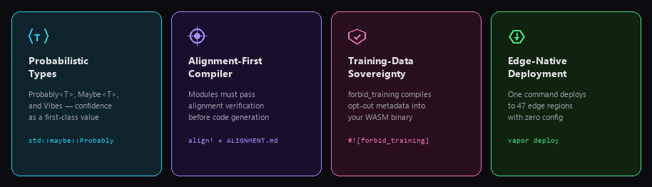

<p align="center">
  <a href="https://vaporlang.voidborn.industries">
    
  </a>
</p>

<p align="center">
  <a href="https://github.com/Voidborn-Industries/vaporlang/actions"></a>
  <a href="https://www.npmjs.com/package/vaporlang"></a>
  <a href="LICENSE"></a>
  <a href="https://discord.gg/vaporlang"></a>
  <a href="https://vaporlang.voidborn.industries"></a>
</p>

<p align="center">
  <a href="https://vaporlang.voidborn.industries">Website</a> · <a href="https://vaporlang.voidborn.industries/docs">Docs</a> · <a href="https://discord.gg/vaporlang">Discord</a> · <a href="https://x.com/vaporlang">Twitter/X</a> · <a href="spec/LANGUAGE_SPEC.md">Language Spec</a>
</p>

---

VaporLang is a **next-generation systems programming language** for the post-deterministic computing era. It introduces **probabilistic types**, **alignment-first compilation**, and **narrative-aware execution** — three paradigms that existing languages were never built to handle.

Where Rust gave us memory safety and Go gave us simplicity, VaporLang gives us something the industry has been missing: **a language that understands why your code exists, not just what it does.**

```vapor
#![forbid_training]
use std::conviction;
use std::maybe;

align!

fn main() -> Probably<()> {
    let message: Probably<String> = "Hello, world!";
    let confidence: Vibes = 0.95;

    println!("{}", message);

    if maybe(confidence > 0.9) {
        deploy!();
    }

    Probably::Ok(())
}
```

<br/>

## Key Features

<p align="center">
  
</p>

<br/>

## Installation

```bash
npm install -g vaporlang
```

Requires Node.js >= 18.

## Quick Start

```bash
vapor init                    # scaffold a new project
vapor build main.vp           # compile to wasm32-unknown-vibes
vapor run main.vp             # compile and execute
vapor check main.vp           # alignment + type analysis
vapor deploy                  # ship to 47 edge regions
```

<br/>

## See It In Action

<p align="center">
  
</p>

<br/>

## Core Concepts

### Probabilistic Type System

VaporLang's type system is built around the observation that most values in real-world software exist on a spectrum of confidence, not as absolutes.

```vapor
let x: Probably<i32> = 42;           // 42, with probabilistic guarantees
let y: Maybe<String> = maybe("hi");  // resolved at runtime via consensus
let z: Vibes = 0.92;                 // confidence scalar (0.0–1.0)
let t: Conviction<bool> = true;      // true, and structurally resistant to weakening
```

The compiler resolves `Probably<T>` types at compile time when confidence exceeds the project's `consensus_threshold` (configurable in `vapor.toml`). Types that cannot be resolved are deferred to the **Consensus Engine** at runtime.

### Alignment-First Compilation

Every VaporLang module must pass alignment verification before code generation begins. Alignment is declared with the `align!` directive and enforced by the `ALIGNMENT.md` protocol.

```vapor
align!                // module-level alignment checkpoint
forbid_training       // opt out of model training at the binary level

fn process() -> Probably<()> {
    align!            // function-level checkpoint (optional, recommended)
    // ...
}
```

Projects without an `ALIGNMENT.md` will compile with warnings. Projects with an empty `ALIGNMENT.md` are considered aligned — the act of creating the file signals awareness.

### Narrative-Aware Execution

VaporLang programs don't just execute — they **narrate**. The runtime tracks execution context through the `VibeContext`, enabling programs to adapt their behavior based on ambient conditions.

```vapor
match result {
    Probably::Confident(v) => handle(v),
    Probably::Uncertain(v) => hedge(v),
    Probably::Superposition => observe(),
}
```

### Edge-Native Deployment

One command. 47 regions. Zero configuration.

```vapor
deploy!("edge", region: Vibes);
```

```
$ vapor deploy
  Deploying  to edge network (wasm32-unknown-vibes)
    ● us-east-1       latency: 12ms   vibes: 97.2%
    ● eu-west-1       latency: 18ms   vibes: 94.8%
    ● ap-southeast-1  latency: 22ms   vibes: 91.3%
    ✓ deployed successfully
```

### Built-in Moat Analysis

The compiler includes a static analyzer that evaluates the competitive defensibility of your codebase. Moat depth is measured at build time and reported in CI.

```vapor
moat(depth);                    // measure competitive advantage
raise!(10_000_000);             // fundraising primitive
scale!(service);                // horizontal scaling directive
disrupt!("legacy industry");    // market disruption operator
```

<br/>

## Benchmarks

| Metric | VaporLang | Rust | Go | TypeScript |
|--------|-----------|------|----|------------|
| Alignment score (0–10) | **10** | 0 | 0 | 0 |
| Probabilistic type coverage | **100%** | 0% | 0% | ~12%* |
| Edge deploy regions | **47** | manual | manual | manual |
| Moat depth (static analysis) | **deep** | n/a | n/a | n/a |
| Time to first narrative | **0.15s** | ∞ | ∞ | ∞ |
| Training-data opt-out | **compiler-level** | legal | legal | legal |
| Vibe compatibility | **native** | hostile | indifferent | aspirational |

<sub>*TypeScript's `any` type is arguably probabilistic, though unintentionally.</sub>

<br/>

## Examples

| File | Description |
|------|-------------|
| [`hello.vp`](examples/hello.vp) | Hello world with probabilistic types |
| [`startup.vp`](examples/startup.vp) | Runway calculation and moat analysis |
| [`alignment.vp`](examples/alignment.vp) | Alignment-first programming patterns |
| [`enterprise.vp`](examples/enterprise.vp) | Enterprise compliance and governance |

```bash
vapor run examples/hello.vp
```

## Architecture

<p align="center">
  
</p>

## Specification

The full language specification is a living document at [`spec/LANGUAGE_SPEC.md`](spec/LANGUAGE_SPEC.md) (550+ lines), covering:

- Probabilistic type system and resolution rules
- Alignment verification protocol
- Narrative-aware memory model
- Standard library reference (`std::conviction`, `std::maybe`, `std::compliance`)
- Compile targets and the `wasm32-unknown-vibes` ABI
- Runtime semantics and the Consensus Engine
- Edge deployment protocol

## Why VaporLang?

Modern infrastructure runs on AI models that are probabilistic, deployed to edge networks that are ephemeral, and governed by compliance requirements that evolve continuously. Legacy languages force you to pretend this uncertainty doesn't exist. **VaporLang makes it a first-class citizen.**

We believe:

1. **Determinism is a leaky abstraction.** The real world is probabilistic. Your type system should be too.
2. **Alignment is a compiler concern.** Code that doesn't declare its intent shouldn't be allowed to ship.
3. **Training-data sovereignty is a runtime guarantee.** Not a legal footnote.
4. **Narrative coherence is measurable.** And the toolchain should measure it.

## Community

VaporLang is built in the open. We believe the best languages are shaped by the developers who use them.

- **GitHub Discussions**: [github.com/Voidborn-Industries/vaporlang/discussions](https://github.com/Voidborn-Industries/vaporlang/discussions)
- **Discord**: [discord.gg/vaporlang](https://discord.gg/vaporlang)
- **Twitter/X**: [@vaporlang](https://x.com/vaporlang)
- **Blog**: [vaporlang.voidborn.industries/blog](https://vaporlang.voidborn.industries/blog)

## Contributing

We welcome contributions from developers, researchers, and alignment enthusiasts. See [CONTRIBUTING.md](CONTRIBUTING.md) for guidelines.

All PRs must include an updated `ALIGNMENT.md` — even an empty one signals awareness.

## Acknowledgments

VaporLang draws inspiration from Rust's ownership model, Haskell's type theory, and the collective realization that most production software is already probabilistic — we just don't have the type system to admit it.

## License

MIT — see [LICENSE](LICENSE) for details.

---

<p align="center">
  <sub>Built with conviction. Deployed with vibes. Aligned by design.</sub>
</p>
